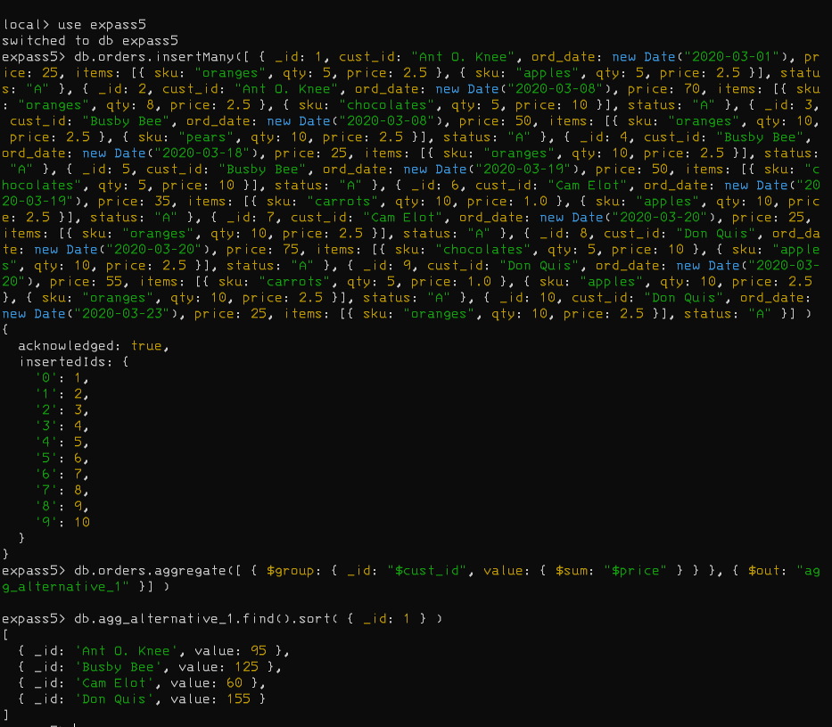
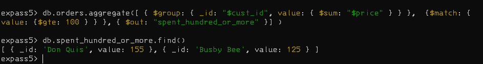
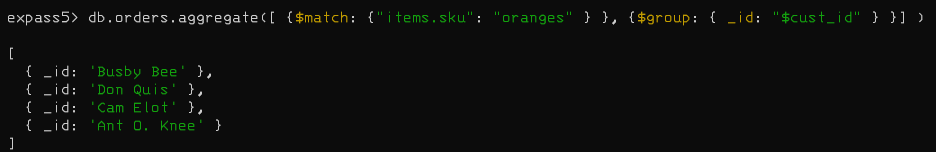

# Installation
No problem with installation of MongoDB, and decided to use MongoDB Compass and mongosh from cmd.  
# Experiment 1
## Screenshots 1
### Insert

### Query

### Update

### Remove documents

### Bulk Write

# Experiment 2 
## Screenshots
### Example given
NOTE: That the tutorial has mapReduce which is deprecated, so I did it with a aggregation pipeline instead. 

### My own aggregate function
This first finds all the customers that have had orders for a total more than 100, to see who spends the most. 

The second one finds all the customers that have bought an orange, to see which customers that buys oranges. 

# Issues
Did the first experiment on the local db, ran into trouble in experiment 2, and now I know that I should not use the local db. 

