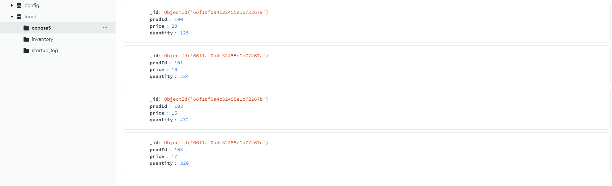
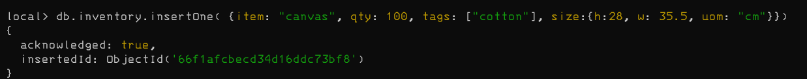
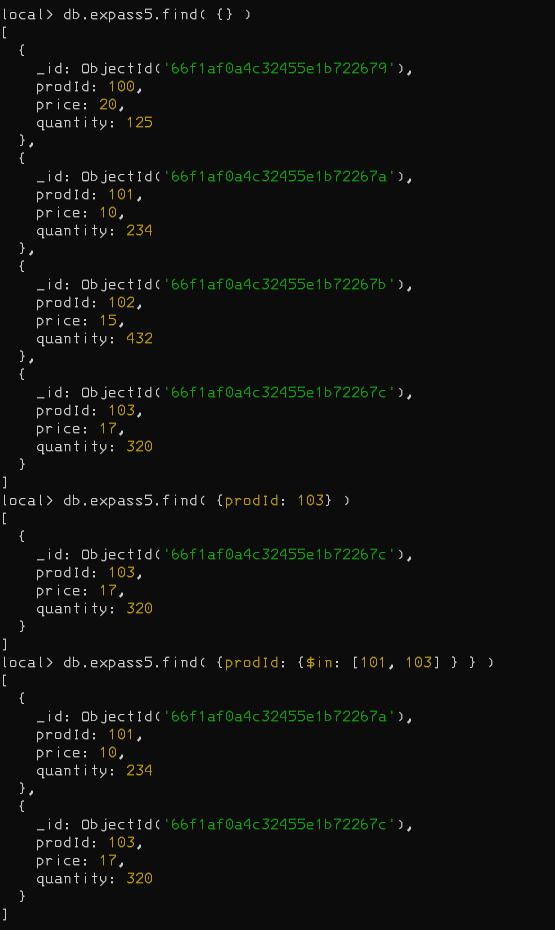
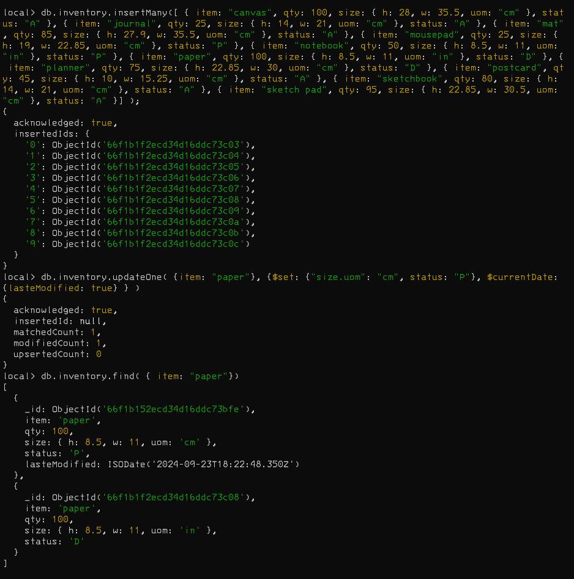
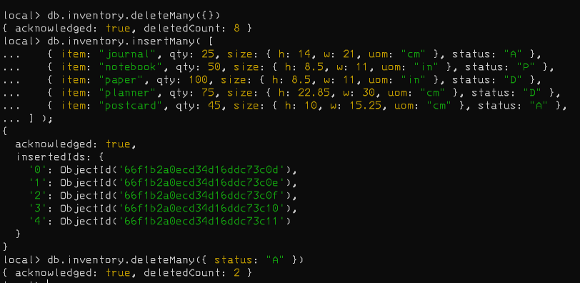
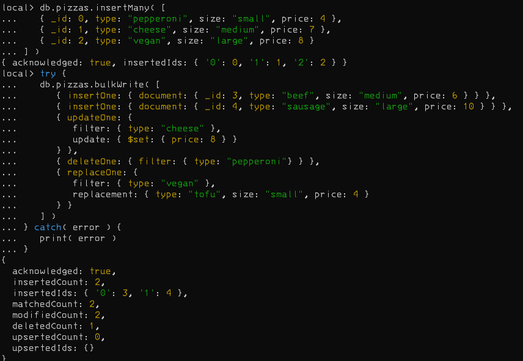

# Installation
No problem with installation of MongoDB, and decided to use MongoDB Compass.  
# Experiment 1
## Screenshots 1
### Insert

### Query

### Update

### Remove documents

### Bulk Write

# Experiment 2 
## Screenshots
### Example given
NOTE: That the tutorial has mapReduce which is deprecated, so I did it with a aggregation pipeline instead. 

